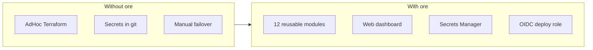

<div align="center">

# ore


### AWS Infrastructure Toolkit + Visual Control Plane

[](LICENSE)


</div>

> Production AWS infrastructure for SaaS — modular Terraform, visual management UI, CI/CD, and security-first defaults. Deploy VPC → ECS → RDS from a canvas or the CLI without reinventing the wheel.

**Perfect for:** SaaS teams shipping on AWS, DevOps portfolios, Terraform learning with real modules, and projects that need ECS + RDS + ALB + secrets + monitoring out of the box.

---

## Table of Contents

- [Overview](#overview)
- [Quick Start](#quick-start)
- [Architecture](#architecture)
- [Project Layout](#project-layout)
- [API & Tools](#api--tools)
- [Verification & Testing](#verification--testing)
- [Configuration](#configuration)
- [AWS Setup](#aws-setup)
- [Troubleshooting](#troubleshooting)
- [Documentation](#documentation)
- [Production Checklist](#production-checklist)
- [License](#license)

---

## Overview

**ore** packages opinionated, production-grade AWS defaults in two layers:

1. **Terraform stack** — 12 reusable modules (VPC, ECS Fargate, RDS, ALB, secrets, monitoring, CI/OIDC).
2. **Web UI** (`web/`) — visual canvas, tfvars editor, `plan`/`apply`/`destroy` with live output, CloudWatch metrics.



**Key decisions:** [docs/DECISIONS.md](docs/DECISIONS.md) · **Problems solved:** [docs/PROBLEMS.md](docs/PROBLEMS.md)

### What You Get

| Area | Stack | Notes |
|------|-------|-------|
| **IaC** | Terraform + AWS provider 5.x | `>= 1.5`, remote S3 state |
| **Web API** | Node.js + Express + PostgreSQL | JWT, app DB (users/audit/costs); tfvars on disk |
| **Web UI** | React + Vite + Tailwind | Canvas, terminal, monitor dashboard |
| **Compute** | ECS Fargate + autoscaling | Rolling deploys, ECR |
| **Database** | RDS PostgreSQL 15 | Multi-AZ in prod tfvars |
| **Edge** | ALB + optional CloudFront | HTTPS via ACM |
| **Secrets** | AWS Secrets Manager | Injected into task definitions |
| **Observability** | CloudWatch + SNS alarms | Optional Datadog forwarder |
| **Cost** | AWS Budgets module | Optional monthly alerts |
| **CI/CD** | GitHub Actions + GitLab CI | OIDC deploy role |
| **Sample app** | Node.js (`examples/app`) | ECS deploy walkthrough |

### Capabilities

| Area | Capability | Status |
|------|------------|--------|
| **Networking** | VPC, NAT, security groups, optional flow logs | ✅ |
| **Compute** | ECS Fargate + target-tracking autoscaling | ✅ |
| **Database** | RDS PostgreSQL, backups, Multi-AZ (prod) | ✅ |
| **Edge** | ALB + optional CloudFront | ✅ |
| **Secrets** | AWS Secrets Manager | ✅ |
| **Observability** | CloudWatch logs/alarms; optional Datadog | ✅ |
| **Cost** | AWS Budgets module | ✅ Optional |
| **Access** | Client VPN, SSM endpoints | ✅ Optional |
| **Web UI** | Canvas, tfvars editor, Terraform runner, metrics | ✅ |
| CodeDeploy blue-green | Rolling deploy today | 🔜 Roadmap |
| WAF / Prometheus | — | 🔜 Roadmap |

---

## Quick Start

### Prerequisites

- **Node.js** 18+ (Web UI local dev)
- **Docker** & **Docker Compose** v2.24+ (recommended for Web UI)
- **Terraform** >= 1.5 (plan/apply from UI or CLI)
- **AWS CLI** configured (`aws configure` or env vars)
- Ports **3001**, **5173** available (Web UI)
- IAM permissions for VPC, ECS, RDS, ALB, CloudWatch (deploy)

### Option A — Web UI + Docker (recommended)

```bash
git clone https://github.com/faharid/ore
cd ore/web
docker compose up --build
```

Wait ~30s for containers, then open:

| Service | URL | Purpose |
|---------|-----|---------|
| **App** | http://localhost:5173 | React dashboard (canvas, terminal) |
| **API** | http://localhost:3001 | Express backend |
| **Health** | http://localhost:3001/health | API liveness |
| **Monitor** | http://localhost:5173/monitor | CloudWatch metrics (after deploy) |

| User | Password |
|------|----------|
| `admin` | `admin` |

**First steps:** Login → create/select environment → configure modules → **Plan** → **Apply** → open **Monitor**.

More detail: [docs/WEB-UI.md](docs/WEB-UI.md)

### Option B — Web UI native dev

```bash
git clone https://github.com/faharid/ore
cd ore

# Terminal 1 — API
cd web/backend
cp .env.example .env
npm install && npm start

# Terminal 2 — UI
cd web/frontend
npm install && npm run dev
```

| Service | URL |
|---------|-----|
| **App** | http://localhost:5173 |
| **API** | http://localhost:3001 |

Ensure `TERRAFORM_DIR` in `web/backend/.env` points to `ore/terraform` and AWS credentials are set.

### Option C — Terraform CLI only

```bash
git clone https://github.com/faharid/ore
cd ore/terraform

# Once per AWS account: remote state
cd bootstrap
terraform init && terraform apply -var="state_bucket_name=YOUR_UNIQUE_BUCKET"

# Per environment
cd ..
cp backend.hcl.example backend.hcl
./scripts/init.sh dev
terraform plan -var-file="environments/dev.tfvars"
terraform apply -var-file="environments/dev.tfvars"
terraform output
```

Deploy sample app to ECS: [docs/FIRST-DEPLOYMENT.md](docs/FIRST-DEPLOYMENT.md)

---

## Architecture

```
                         ┌──────────────────────────────────────┐
                         │  ore Web UI (optional, local/Docker) │
                         │  React + Express → Terraform CLI     │
                         │  CloudWatch metrics via AWS SDK      │
                         └─────────────────┬────────────────────┘
                                           │ plan / apply / tfvars
┌──────────────────────────────────────────▼──────────────────────────┐
│                         AWS Account                                    │
│  Internet ──► ALB (optional CloudFront) ──► ECS Fargate (private)     │
│                              │                      │                  │
│                              │                      └──► RDS PostgreSQL │
│                              │                           (private)     │
│  Secrets Manager ◄───────────┴── task execution role                   │
│  CloudWatch Logs / SNS alarms                                          │
│  GitHub Actions / GitLab CI ──OIDC──► deployment role ──► ECR + ECS   │
└───────────────────────────────────────────────────────────────────────┘
```

---

## Project Layout

```
ore/
├── web/                          # Management UI
│   ├── backend/                  # Express API (auth, terraform, metrics)
│   │   ├── src/routes/           # auth, environments, terraform, monitoring
│   │   ├── src/services/         # config, terraform runner, aws-metrics
│   │   └── scripts/hash-password.js
│   ├── frontend/                 # React + Vite
│   │   └── src/
│   │       ├── pages/            # Login, Dashboard, Monitor
│   │       └── components/       # Canvas, ConfigPanel, Terminal, MonitorDash
│   ├── docker-compose.yml
│   └── README.md                 # → docs/WEB-UI.md
├── terraform/                    # Infrastructure as code
│   ├── main.tf
│   ├── modules/                  # vpc, ecs, rds, alb, autoscaling, monitoring,
│   │                             # secrets, iam, cloudfront, budgets, client_vpn, ssm
│   ├── environments/             # dev.tfvars, staging.tfvars, prod.tfvars
│   ├── bootstrap/                # S3 + DynamoDB remote state
│   ├── scripts/                  # init, deploy, destroy, health-check
│   └── ci-cd/                    # GitHub Actions + GitLab templates
├── examples/
│   ├── app/                      # Sample Node.js app for ECS
│   └── multi-region/             # Per-region state key pattern
├── docs/                         # Architecture, security, DR, costs…
├── tests/terraform_validate.sh
├── Dockerfile                    # Sample app image
├── .github/workflows/            # terraform.yml (validate/plan)
├── .gitlab-ci.yml
└── CONTRIBUTING.md
```

### Terraform modules (12)

| Module | Purpose |
|--------|---------|
| `vpc` | VPC, subnets, NAT, security groups, optional flow logs |
| `ecs` | Fargate cluster, task definition, service, ECR |
| `rds` | PostgreSQL, subnet/parameter groups, backups |
| `alb` | Load balancer, target group, HTTPS (ACM) |
| `autoscaling` | ECS target-tracking on CPU |
| `monitoring` | Log groups, SNS alarms |
| `secrets` | Secrets Manager (+ Vault stub) |
| `iam` | Task execution, deployment (OIDC) roles |
| `cloudfront` | CDN in front of ALB |
| `budgets` | Monthly cost alerts |
| `client_vpn` | Admin VPN into VPC |
| `ssm` | VPC interface endpoints |

---

## API & Tools

### REST endpoints (summary)

| Group | Endpoints |
|-------|-----------|
| **Auth** | `POST /api/auth/login` |
| **Environments** | `GET/POST /api/environments`, `GET/PUT/DELETE /api/environments/:env` |
| **Terraform** | `POST …/:env/plan`, `…/apply`, `…/destroy` (SSE) · `GET …/:env/outputs` |
| **Monitoring** | `GET …/:env/metrics`, `GET …/:env/status` |
| **Health** | `GET /health` |

All routes except `/api/auth/login` and `/health` require `Authorization: Bearer <token>`.

Full reference: [docs/WEB-UI.md](docs/WEB-UI.md#api-endpoints)

### Web UI flows

| Page | Actions |
|------|---------|
| **Dashboard** | Select environment → drag modules → edit tfvars → Plan / Apply / Destroy → terminal output |
| **Monitor** | ECS CPU/memory/tasks, RDS CPU/storage, ALB requests & 5xx (30s refresh) |
| **Login** | JWT stored in `localStorage`; auto-logout on 401 |

---

## Verification & Testing

```bash
# Terraform validate (bootstrap + root)
bash tests/terraform_validate.sh

# Pre-commit (fmt, validate, tflint)
pre-commit install && pre-commit run --all-files

# CI runs the same on push/PR (.github/workflows/terraform.yml)
```

### Quick smoke test

```bash
# Web API health (native or Docker)
curl http://localhost:3001/health
# {"status":"ok","timestamp":"..."}

# Login
curl -X POST http://localhost:3001/api/auth/login \
  -H "Content-Type: application/json" \
  -d '{"username":"admin","password":"admin"}'
# {"token":"...","username":"admin"}

# List environments (replace TOKEN)
curl http://localhost:3001/api/environments \
  -H "Authorization: Bearer TOKEN"

# Terraform fmt check
cd terraform && terraform fmt -check -recursive
```

After AWS deploy:

```bash
cd terraform && ./scripts/health-check.sh
# or
curl "$(terraform output -raw application_url)/api/health"
```

---

## Configuration

Copy examples and adjust:

```bash
cp web/backend/.env.example web/backend/.env
cp terraform/backend.hcl.example terraform/backend.hcl   # after bootstrap
cp terraform/terraform.tfvars.example terraform/terraform.tfvars  # optional
```

### Web backend (`web/backend/.env`)

| Variable | Description |
|----------|-------------|
| `PORT` | API port (default `3001`) |
| `JWT_SECRET` | Token signing — use a strong value in prod |
| `DATABASE_URL` | PostgreSQL connection (recommended for Web UI) |
| `SEED_ADMIN_PASSWORD` | Initial admin password when DB is empty |
| `USERS` / `USERS_FILE` | File-only auth fallback (bcrypt hashes) |
| `TERRAFORM_DIR` | Path to `ore/terraform` |
| `ENVIRONMENTS_DIR` | Path to `terraform/environments` |
| `AWS_REGION` | Optional; defaults via AWS credential chain |
| `AWS_ACCESS_KEY_ID` / `AWS_SECRET_ACCESS_KEY` | Optional if not using `~/.aws/credentials` |

```bash
# Generate bcrypt password hash
cd web/backend
node scripts/hash-password.js yourpassword
# Paste hash into USERS in .env
```

### Terraform

| File | Purpose |
|------|---------|
| `terraform/environments/dev.tfvars` | Dev sizing (single NAT, no Multi-AZ) |
| `terraform/environments/staging.tfvars` | Pre-prod defaults |
| `terraform/environments/prod.tfvars` | Multi-AZ, dual NAT, longer backups |
| `terraform/backend.hcl` | S3 state bucket + key (gitignored) |

Module field reference: [docs/WEB-UI.md](docs/WEB-UI.md#module-configuration-fields)

---

## AWS Setup

1. **Configure credentials** (one of):
   - `aws configure`
   - Env vars: `AWS_ACCESS_KEY_ID`, `AWS_SECRET_ACCESS_KEY`, `AWS_REGION`
   - IAM role (EC2/ECS) or SSO profile

2. **Bootstrap remote state** (once per account):

```bash
cd terraform/bootstrap
terraform init && terraform apply -var="state_bucket_name=YOUR_UNIQUE_BUCKET"
```

3. **Wire backend** — copy outputs into `terraform/backend.hcl` (see `backend.hcl.example`).

4. **OIDC for CI** (recommended for production): [docs/CI-OIDC.md](docs/CI-OIDC.md)

5. **Optional budgets** — in tfvars:

```hcl
enable_budgets       = true
monthly_budget_limit = "200"
alarm_email          = "ops@example.com"
```

Cost estimates: [docs/COST-ANALYSIS.md](docs/COST-ANALYSIS.md)

---

## Troubleshooting

| Symptom | Fix |
|---------|-----|
| **Port 3001 / 5173 in use** | `lsof -i :3001` / `lsof -i :5173` — stop conflicting process |
| **Login fails** | Check `USERS` JSON in `.env`; password must be bcrypt-hashed (`hash-password.js`) |
| **Terraform command not found** | Install Terraform >= 1.5; ensure binary is on `PATH` inside Docker/host |
| **`terraform init` fails** | Verify `TERRAFORM_DIR`; check AWS credentials and region |
| **Plan/apply fails from UI** | Read terminal panel; ensure env tfvars exist under `terraform/environments/` |
| **Metrics show "No data"** | Infrastructure must be deployed first; IAM needs CloudWatch read |
| **CORS / API unreachable from UI** | Backend on `:3001`; check `vite.config.js` proxy in dev |
| **ECS tasks unhealthy** | Align `container_port` + `health_check_path` with your app |
| **ALB 502** | Security groups, app listening on correct port — [docs/TROUBLESHOOTING.md](docs/TROUBLESHOOTING.md) |

Logs:

```bash
# Docker
cd web && docker compose logs -f backend
docker compose logs -f frontend

# ECS (after deploy)
aws logs tail "/ecs/SERVICE_NAME" --follow
```

Deep dives: [docs/TROUBLESHOOTING.md](docs/TROUBLESHOOTING.md)

---

## Documentation

| Doc | Contents |
|-----|----------|
| [DOCUMENTATION_INDEX.md](DOCUMENTATION_INDEX.md) | Full doc map |
| [docs/WEB-UI.md](docs/WEB-UI.md) | Web UI setup, API, configuration |
| [docs/WEB-UI-VERIFICATION.md](docs/WEB-UI-VERIFICATION.md) | Smoke tests |
| [docs/ROADMAP.md](docs/ROADMAP.md) | Pending Web UI features |
| [CHANGELOG.md](CHANGELOG.md) | Release history |
| [PRODUCT.md](PRODUCT.md) | Product definition |
| [docs/ARCHITECTURE.md](docs/ARCHITECTURE.md) | AWS components and data flow |
| [docs/DECISIONS.md](docs/DECISIONS.md) | Architecture decision records |
| [docs/FIRST-DEPLOYMENT.md](docs/FIRST-DEPLOYMENT.md) | Deploy sample app to ECS |
| [docs/DEPLOYMENT.md](docs/DEPLOYMENT.md) | Infrastructure deployment |
| [docs/COST-ANALYSIS.md](docs/COST-ANALYSIS.md) | Dev / staging / prod costs |
| [docs/SECURITY.md](docs/SECURITY.md) | Security audit checklist |
| [docs/DISASTER-RECOVERY.md](docs/DISASTER-RECOVERY.md) | Failover, PITR, secret rotation |
| [docs/TROUBLESHOOTING.md](docs/TROUBLESHOOTING.md) | Scenario-based fixes |
| [docs/CI-OIDC.md](docs/CI-OIDC.md) | GitHub / GitLab OIDC |
| [CONTRIBUTING.md](CONTRIBUTING.md) | Extend modules and Web UI |

---

## Production Checklist

- [ ] Apply with `environments/prod.tfvars` (Multi-AZ, dual NAT, 30-day backups)
- [ ] RDS automated backups + tested restore runbook
- [ ] Secrets in AWS Secrets Manager (not `.env` in git)
- [ ] `JWT_SECRET` and `USERS` rotated on Web UI if exposed beyond localhost
- [ ] ACM certificate + HTTPS on ALB or CloudFront
- [ ] OIDC CI role configured (no long-lived AWS keys)
- [ ] Remote state bootstrap + **unique state key** per environment
- [ ] CloudWatch alarms → SNS verified
- [ ] AWS Budgets or cost alerts enabled
- [ ] Load testing completed ([docs/PERFORMANCE.md](docs/PERFORMANCE.md))

---

## License

MIT — see [LICENSE](LICENSE).

---

**Built for teams that ship on AWS. Production patterns, visual ops, minimal glue code.**

**Faharid Manjarrez** — [github.com/faharid/ore](https://github.com/faharid/ore)

Topics: `terraform`, `aws`, `saas`, `infrastructure-as-code`, `devops`, `react`
