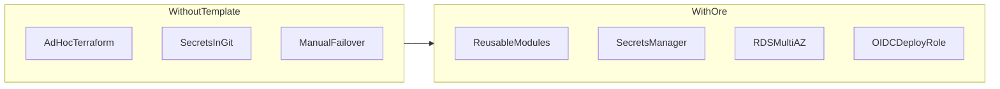

<div align="center">

# ore


> Production AWS infrastructure for SaaS — modular Terraform, CI/CD, observability, security-first.


</div>

## Why ore?

Building AWS infrastructure from scratch for every SaaS product wastes weeks and repeats the same mistakes: public RDS endpoints, secrets in git, single-AZ databases, and CI pipelines with long-lived AWS keys.

**ore** is an opinionated, modular Terraform stack that encodes fintech-grade defaults: private networking, ECS Fargate, RDS Multi-AZ (in prod), Secrets Manager, and OIDC-ready CI/CD.



**Key decisions:** [docs/DECISIONS.md](docs/DECISIONS.md) · **Problems solved:** [docs/PROBLEMS.md](docs/PROBLEMS.md)

## Capabilities vs roadmap

| Capability | Status |
|------------|--------|
| VPC, NAT, security groups | Implemented |
| ECS Fargate + auto-scaling | Implemented |
| RDS PostgreSQL + backups | Implemented |
| ALB + optional CloudFront | Implemented |
| Secrets Manager | Implemented |
| CloudWatch alarms + SNS | Implemented |
| OIDC CI deploy role | Implemented ([CI-OIDC.md](docs/CI-OIDC.md)) |
| Rolling ECS deploys | Implemented |
| Datadog forwarder hook | Optional (Lambda ARN) |
| Vault sync | Stub / documented only |
| CodeDeploy blue-green | Roadmap (rolling today) |
| WAF / Prometheus | Roadmap |

## What's included

- **Networking:** VPC with public/private subnets, NAT, security groups
- **Compute:** ECS Fargate (containerized apps, auto-scaling)
- **Database:** RDS PostgreSQL with automated backups, Multi-AZ (prod)
- **Load balancing:** ALB with HTTPS when ACM cert is configured
- **Secrets:** AWS Secrets Manager (Vault paths documented as optional)
- **Monitoring:** CloudWatch logs and alarms; optional Datadog log subscription
- **CI/CD:** GitHub Actions + GitLab CI at repo root
- **Security:** Encryption, private RDS, least-privilege IAM, SSM endpoints

## Quick Start

```bash
# Clone
git clone https://github.com/faharid/ore
cd ore/

# 0. Bootstrap remote state (once per account)
cd terraform/bootstrap
terraform init && terraform apply -var="state_bucket_name=YOUR_UNIQUE_BUCKET"

# 1. Configure backend + init (per environment)
cp backend.hcl.example backend.hcl   # edit bucket/table from bootstrap
./scripts/init.sh dev

# 2. Plan & apply
terraform plan -var-file="environments/dev.tfvars"
terraform apply -var-file="environments/dev.tfvars"

# 3. Outputs (ALB DNS, RDS endpoint, etc.)
terraform output
```

See [docs/FIRST-DEPLOYMENT.md](docs/FIRST-DEPLOYMENT.md) for app deploy walkthrough and [docs/DEPLOYMENT.md](docs/DEPLOYMENT.md) for infrastructure details.

## Architecture

```
┌─────────────────────────────────────────────────────┐
│                    Internet                         │
└────────────────────┬────────────────────────────────┘
                     │ HTTPS (CloudFront optional)
                ┌────▼─────────────────┐
                │   Application        │
                │   Load Balancer      │
                │   (ALB)              │
                └────┬─────────────────┘
                     │
         ┌───────────┴────────────┐
         │                        │
    ┌────▼──────────┐    ┌────────▼───────┐
    │  ECS Fargate  │    │  ECS Fargate   │  (Auto-scaled)
    │  Container 1  │    │  Container 2   │
    │  (App)        │    │  (App)         │
    └────┬──────────┘    └────────┬───────┘
         │                        │
         └───────────┬────────────┘
                     │
         ┌───────────▼────────────┐
         │  RDS PostgreSQL        │  (Multi-AZ)
         │  - Primary replica     │
         │  - Standby replica     │
         │  - Automated backups   │
         └────────────────────────┘

Secrets:
  API keys → AWS Secrets Manager → Injected to containers

Monitoring:
  Containers → CloudWatch Logs → optional Datadog forwarder

CI/CD:
  Git push → GitHub Actions / GitLab CI → validate → build → deploy to ECS
```

## Directory Structure

```
terraform/
├── main.tf                          # Root module (for single deploy)
├── variables.tf                     # Input variables
├── outputs.tf                       # Outputs (endpoints, etc.)
├── terraform.tfvars.example         # Copy & fill with your values
│
├── modules/                         # Reusable modules
│   ├── vpc/
│   │   ├── main.tf                  # VPC + subnets + NAT
│   │   ├── variables.tf
│   │   ├── outputs.tf
│   │   └── security-groups.tf       # Security groups
│   │
│   ├── ecs/
│   │   ├── main.tf                  # ECS cluster + Fargate
│   │   ├── task-definition.tf       # Container definition
│   │   ├── service.tf               # ECS service + auto-scaling
│   │   ├── variables.tf
│   │   ├── outputs.tf
│   │   └── iam-roles.tf             # Task execution role
│   │
│   ├── rds/
│   │   ├── main.tf                  # RDS PostgreSQL
│   │   ├── variables.tf
│   │   ├── outputs.tf
│   │   ├── subnet-group.tf          # DB subnet group
│   │   ├── parameter-group.tf       # DB parameters (optimization)
│   │   └── backups.tf               # Backup configuration
│   │
│   ├── alb/
│   │   ├── main.tf                  # Application Load Balancer
│   │   ├── target-group.tf          # Target group (ECS tasks)
│   │   ├── listener.tf              # HTTP/HTTPS listeners
│   │   ├── variables.tf
│   │   ├── outputs.tf
│   │   └── ssl-certificate.tf       # ACM certificate (HTTPS)
│   │
│   ├── autoscaling/
│   │   ├── main.tf                  # Auto-scaling policy
│   │   ├── variables.tf
│   │   └── outputs.tf
│   │
│   ├── monitoring/
│   │   ├── main.tf                  # CloudWatch + Datadog
│   │   ├── cloudwatch-alarms.tf     # Alarms (high CPU, high memory)
│   │   ├── log-groups.tf            # CloudWatch log groups
│   │   ├── variables.tf
│   │   └── outputs.tf
│   │
│   ├── secrets/
│   │   ├── main.tf                  # AWS Secrets Manager
│   │   ├── vault-integration.tf      # Vault integration (optional)
│   │   ├── variables.tf
│   │   └── outputs.tf
│   │
│   └── iam/
│       ├── main.tf                  # IAM roles + policies
│       ├── task-execution-role.tf   # For ECS tasks
│       ├── deployment-role.tf       # For CI/CD deployments
│       ├── variables.tf
│       └── outputs.tf
│
├── environments/                    # Environment-specific configs
│   ├── dev.tfvars                   # Development environment
│   ├── staging.tfvars               # Staging environment
│   └── prod.tfvars                  # Production environment
│
├── scripts/
│   ├── init.sh                      # First-time setup
│   ├── deploy.sh                    # Deployment script
│   ├── destroy.sh                   # Tear down (⚠️)
│   └── health-check.sh              # Verify deployment
│
├── ci-cd/
│   ├── gitlab-ci.yml                # GitLab CI pipeline
│   ├── github-actions/
│   │   └── deploy.yml               # GitHub Actions alternative
│   └── scripts/
│       ├── build.sh                 # Build Docker image
│       ├── test.sh                  # Run tests
│       ├── push.sh                  # Push to ECR
│       └── deploy.sh                # Deploy to ECS
│
└── README.md (this file)

docs/                               # Documentation
├── ARCHITECTURE.md                  # Detailed architecture
├── DEPLOYMENT.md                    # Step-by-step deployment
├── SCALING.md                       # Scaling strategies
├── SECURITY.md                      # Security best practices
├── DISASTER-RECOVERY.md             # Backup + recovery
└── TROUBLESHOOTING.md               # Common issues + fixes
```

## Key Components Explained

### 1. VPC (Virtual Private Cloud)

Isolated network with public/private subnets:

```hcl
# modules/vpc/main.tf
module "vpc" {
  source = "./modules/vpc"
  
  vpc_cidr = "10.0.0.0/16"
  
  public_subnets = [
    "10.0.1.0/24",   # AZ-1
    "10.0.2.0/24"    # AZ-2
  ]
  
  private_subnets = [
    "10.0.10.0/24",  # AZ-1
    "10.0.11.0/24"   # AZ-2
  ]
}
```

**Benefits:** Network isolation, multi-AZ for high availability

### 2. ECS Fargate (Compute)

Run containers without managing servers:

```hcl
# modules/ecs/main.tf
module "ecs" {
  source = "./modules/ecs"
  
  cluster_name = "saas-cluster"
  
  # Task definition
  container_image = "YOUR_ECR_URL/app:latest"
  container_port = 3001
  
  # Scaling
  desired_count = 2
  min_capacity = 1
  max_capacity = 10
  
  # Environment
  environment_variables = {
    DATABASE_URL = module.rds.connection_string
    REDIS_URL = "redis://cache:6379"
  }
}
```

**Benefits:** No server management, auto-scaling, pay per container usage

### 3. RDS PostgreSQL (Database)

Managed relational database:

```hcl
# modules/rds/main.tf
module "rds" {
  source = "./modules/rds"
  
  instance_class = "db.t3.medium"  # Size (t3.small for dev, t3.xlarge for prod)
  allocated_storage = 100          # 100 GB initial
  
  # High availability
  multi_az = true                  # Standby replica in different AZ
  
  # Backups
  backup_retention_period = 30     # Keep 30 days of backups
  backup_window = "03:00-04:00"    # 3 AM UTC
  
  # Database
  engine = "postgres"
  engine_version = "15.2"
  database_name = "saasdb"
  username = "postgres"            # Master user
}
```

**Benefits:** Automated backups, Multi-AZ failover, read replicas for scaling

### 4. Application Load Balancer (ALB)

Distribute traffic to containers:

```hcl
# modules/alb/main.tf
module "alb" {
  source = "./modules/alb"
  
  # Load balancer config
  name = "saas-alb"
  port = 80 / 443
  
  # SSL certificate (HTTPS)
  certificate_arn = aws_acm_certificate.main.arn
  
  # Health check (ECS targets)
  health_check_path = "/api/health"
  health_check_interval = 30
}
```

**Benefits:** High availability, auto-scaling triggers, HTTPS termination

### 5. Auto-Scaling

Automatically scale containers based on metrics:

```hcl
# modules/autoscaling/main.tf
module "autoscaling" {
  source = "./modules/autoscaling"
  
  service_name = "saas-service"
  
  # Scale up when CPU > 70%
  scale_up_threshold = 70
  scale_up_adjustment = 2         # Add 2 tasks
  
  # Scale down when CPU < 30%
  scale_down_threshold = 30
  scale_down_adjustment = -1      # Remove 1 task
  
  # Limits
  min_capacity = 1
  max_capacity = 10
}
```

**Benefits:** Handle traffic spikes automatically, cost optimization

### 6. Monitoring (CloudWatch + Datadog)

```hcl
# modules/monitoring/main.tf
module "monitoring" {
  source = "./modules/monitoring"
  
  # CloudWatch Logs
  log_group = "/ecs/saas-service"
  log_retention = 30              # Keep 30 days
  
  # Alarms
  alarm_email = "ops@company.com"
  
  # Datadog (optional)
  datadog_api_key = var.datadog_api_key
  
  # Metrics to monitor
  metrics = {
    "CPUUtilization" : 80         # Alert if > 80%
    "MemoryUtilization" : 85
    "TargetResponseTime" : 1000    # milliseconds
  }
}
```

**Benefits:** Real-time visibility, proactive alerting

### 7. Secrets Management

Store API keys, passwords securely:

```hcl
# modules/secrets/main.tf
module "secrets" {
  source = "./modules/secrets"
  
  secrets = {
    "database-password" = var.db_password
    "jwt-secret" = var.jwt_secret
    "api-keys/stripe" = var.stripe_api_key
  }
}

# Inject into ECS task:
environment = {
  DATABASE_PASSWORD = aws_secretsmanager_secret_version.db_password.secret_string
}
```

**Benefits:** Encrypted at rest, audit trail, rotation support

### 8. CI/CD Pipeline

Automated deployment on git push:

```yaml
# ci-cd/gitlab-ci.yml
stages:
  - test
  - build
  - deploy

test:
  stage: test
  script:
    - npm install
    - npm run test

build:
  stage: build
  script:
    - docker build -t app:$CI_COMMIT_SHA .
    - aws ecr get-login | docker login --username AWS
    - docker push $ECR_REGISTRY/app:$CI_COMMIT_SHA

deploy:
  stage: deploy
  script:
    - aws ecs update-service --service saas-service --force-new-deployment
```

**Benefits:** Automated testing, containerization, instant deployments

## Deployment Workflow

```
1. Fill terraform.tfvars with your values
2. terraform init
3. terraform plan
4. terraform apply
5. Configure CI/CD (GitLab/GitHub)
6. Push code → Auto-deploys to ECS
```

## Production Checklist

- [ ] Multi-AZ deployment (RDS + ECS)
- [ ] SSL certificate (HTTPS)
- [ ] Auto-scaling policies configured
- [ ] Backups enabled + tested
- [ ] Monitoring + alerts set up
- [ ] VPN for private database access
- [ ] Secrets in Secrets Manager (not .env files)
- [ ] IAM roles follow least privilege
- [ ] CloudWatch logs retention set
- [ ] Disaster recovery plan documented

## Cost Optimization

### Development
```hcl
# dev.tfvars
instance_class = "db.t3.micro"     # Cheapest
ecs_desired_count = 1              # Single container
backup_retention = 7               # 7 days (not 30)
```

### Production
```hcl
# prod.tfvars
instance_class = "db.t3.xlarge"    # Larger
ecs_desired_count = 3              # High availability
ecs_max_capacity = 20              # Scale for traffic
backup_retention = 30              # Long retention
```

## Security Best Practices

1. **Network Isolation:** RDS in private subnet (no internet)
2. **Encryption:** All data encrypted at rest + transit
3. **Secrets Manager:** Use instead of environment variables
4. **IAM Roles:** Each service gets minimal permissions
5. **Security Groups:** Restrictive ingress/egress rules
6. **SSL/TLS:** HTTPS enforced, strong ciphers
7. **VPN:** Optional VPN for direct DB access
8. **Audit Logs:** CloudTrail enabled

## Scaling Strategies

### Vertical Scaling (Larger Instances)
```hcl
# Increase RDS instance size
instance_class = "db.t3.xlarge"

# Increase ECS task CPU/memory
cpu = 512
memory = 1024
```

### Horizontal Scaling (More Instances)
```hcl
# Increase ECS desired count
desired_count = 5

# Increase RDS read replicas
read_replica_count = 2
```

### Database Optimization
```hcl
# Enable query caching
parameter_group = "custom-pg15-optimized"

# Connection pooling via Pgbouncer
# Indexes on frequently queried columns
```

## Repository layout

Infrastructure code lives under `terraform/` with reusable modules, environment tfvars, CI/CD templates, and operational scripts. Documentation is in `docs/`.

## Next Steps

1. **Clone repo**
2. **Read [docs/ARCHITECTURE.md](docs/ARCHITECTURE.md)** (understand what you're deploying)
3. **Bootstrap S3 state** (`terraform/bootstrap`)
4. **Copy `terraform.tfvars.example` → `terraform.tfvars`** (optional)
5. **`./scripts/init.sh dev`** && **`terraform plan -var-file=environments/dev.tfvars`**
6. **`terraform apply`** (review plan first!)
7. **Deploy sample app:** [docs/FIRST-DEPLOYMENT.md](docs/FIRST-DEPLOYMENT.md)
8. **Configure CI/OIDC:** [docs/CI-OIDC.md](docs/CI-OIDC.md)

## Documentation

| Doc | Purpose |
|-----|---------|
| [ARCHITECTURE.md](docs/ARCHITECTURE.md) | Components and data flow |
| [DECISIONS.md](docs/DECISIONS.md) | Architecture decision records |
| [FIRST-DEPLOYMENT.md](docs/FIRST-DEPLOYMENT.md) | End-to-end app deploy |
| [COST-ANALYSIS.md](docs/COST-ANALYSIS.md) | Dev/staging/prod cost estimates |
| [SECURITY.md](docs/SECURITY.md) | Security audit checklist |
| [CONTRIBUTING.md](CONTRIBUTING.md) | How to extend ore |

## Troubleshooting

See [docs/TROUBLESHOOTING.md](docs/TROUBLESHOOTING.md).

## Author

**Faharid Manjarrez** — [github.com/faharid/ore](https://github.com/faharid/ore)

Topics: `terraform`, `aws`, `saas`, `infrastructure-as-code`, `devops`

## License

MIT — see [LICENSE](LICENSE)
